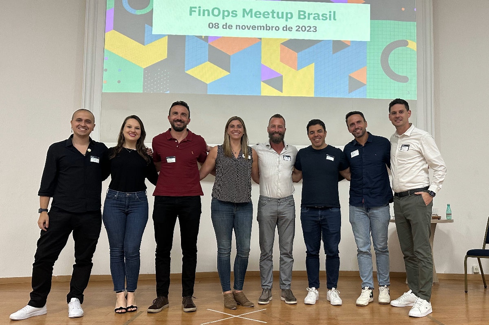

+++
author = "Thiago Gil"
title = "Brasil FinOps Meetup - São Paulo"
date = "2023-11-09"
description = "O amadurecimento e consolidação da comunidade Brasileira"
categories = [
    "finops",
    "meetups",
    "roadshows",
]
tags = [
    "finops",
    "brasil",
    "roadshows",
]
image = "meetup-8-novembro.png"
+++

# Brasil FinOps Meetup: Um sucesso!

Organizado por Cláudia Seffrin, Rodolfo Silva e [Marcelo Scharan](https://www.linkedin.com/in/marceloscharan/), o Brasil FinOps Meetup, realizado no dia 8 de novembro de 2023, foi um sucesso absoluto. O evento reuniu em torno de 200 profissionais de FinOps de todo o Brasil para discutir temas relevantes para a gestão de custos em nuvem.

Tivemos anúncios importantes da [FinOps Foundation](https://www.finops.org/), como a visão da fundação dentro das organizações e principais desafios para o ano de 2024. [J.R. Storment](https://www.linkedin.com/in/jrstorment/), Diretor de Operações da FinOps Foundation, também detalhou o crescimento da comunidade brasileira e seus principais desafios.

## Painel

Moderado por [Claudia Seffrin](https://www.linkedin.com/in/claudiaseffrin/), contou com a participação de [Daniel Dosualdo](https://www.linkedin.com/in/danieldosualdo/), [Filipe Jaske](https://www.linkedin.com/in/filipejaske/) e [Augusto Stracieri](https://www.linkedin.com/in/augusto-stracieri/).

Painelistas trocaram experiências e contaram sobre os principais desafios encontrados em suas empresas, como:

* Escalabilidade dos ambientes de nuvem
* Complexidade da gestão de custos
* Necessidade de colaboração entre as equipes
* Importância de negociações de contratos com cloud providers

Claudia Seffrin conduziu o painel de forma produtiva e informativa, permitindo que os palestrantes compartilhassem insights valiosos e os participantes aprendessem sobre as melhores práticas para gestão de custos em nuvem.

## Novos Membros da FinOps Foundation

Foi anunciado, na figura de [Marcelo Lucchesi](https://www.linkedin.com/in/marcelolucchesi/), a entrada da AWS na FinOps Foundation.

## Diretor de Comunidade

Além disso, o evento contou com o anúncio de [Rodolfo Silva](https://www.linkedin.com/in/rodolfo-dos-santos-silva-a3bba592/) como novo Diretor de comunidade para o Brasil. Rodolfo, organizadores e voluntários agora estão alinhados para que possamos expandir os eventos presenciais e virtuais por todo o Brasil.

Agradecemos a todos os participantes, palestrantes e parceiros que contribuíram para o sucesso do evento. Esperamos vê-los em breve no próximo Brasil FinOps Meetup e fiquem ligados nas próximas postagens com as fotos dos evento!

